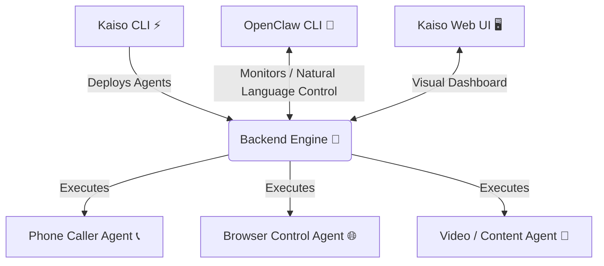

<div align="center">
  <h1>🌐 Workforce OS</h1>
  <p><b>The Synchronized Autonomous AI Mesh for Agencies & Creators</b></p>
</div>

---

## 🌟 The Vision
Workforce OS is a complete, multi-agent operating system designed to replace manual busywork with a synchronized mesh of autonomous AI agents. 

Rather than isolated tools, Workforce OS provides a unified ecosystem where Top-of-Funnel (TOFU) browser agents scrape leads, hand them off to Middle-of-Funnel (MOFU) phone dialing agents, and report analytics back to the user—all managed seamlessly through a premium Web UI or lightning-fast Terminal interface.

---

## 🏗️ Global Architecture

Workforce OS is built as a robust Monorepo consisting of 4 core pillars interacting seamlessly:



---

## 🧩 The 4 Core Pillars

### 1. 🖥️ Frontend (The User Dashboard)
**Location:** `/frontend` | **Tech:** Next.js, React, Tailwind
The consumer-facing web portal for non-technical users. It provides a beautiful, interactive dashboard to deploy agents, simulate multi-agent handoffs, and view global analytics.

### 2. 🧠 Backend (The Agent Brain)
**Location:** `/backend` | **Tech:** Python, FastAPI
The execution engine powering the AI mesh. It handles Agent-to-Agent (A2A) orchestration, database connections (CockroachDB), and the core logic for the Phone and Browser agents.

### 3. ⚡ Kaiso CLI (The Agent Injector)
**Location:** `/kaiso-cli` | **Tech:** Node.js, TypeScript
The deployment engine designed for creators and agency owners. With a single `npm` command, users can inject fully configured autonomous workforce pods directly into their local environments.

### 4. 🦀 OpenClaw (The OS Control Center)
**Location:** `/openclaw-cli` | **Tech:** Rust, Ratatui, SQLx
The blazing-fast developer dashboard. Built for power users, it provides a high-speed Terminal User Interface (TUI) to monitor live memory replays, view the dynamic funnel architecture, and execute natural language queries against the operating system.

---

## 🚀 Quickstart & Installation

**To deploy the Agent Workforce (Kaiso CLI):**
```bash
npm i -g @muhammad-hassaan-shaukat/kaiso-ai
npx @muhammad-hassaan-shaukat/kaiso-ai workforce init
```

**To monitor the System (OpenClaw CLI):**
Download the standalone binary from the [GitHub Releases](../../releases) page, or install via Rust:
```bash
cargo install --git https://github.com/muhammad-hassaan-y2/Workforce_OS_Creators-Marketing openclaw-cli
cargo run
```

**To launch the Web Dashboard (Frontend):**
```bash
cd frontend
npm install
npm run dev
```
