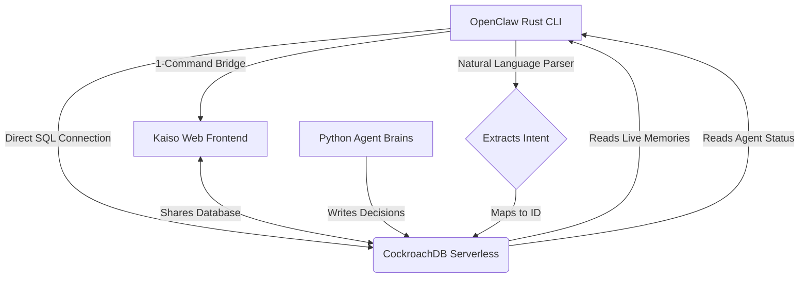

<div align="center">
  <h1>🦀 OpenClaw CLI</h1>
  <p><b>The Blazing-Fast Control Center for Autonomous AI Agents</b></p>
</div>

---

## 🌟 The Vision
Imagine you have a giant factory full of robots (AI Agents) doing work for you—making phone calls, browsing the web, and sending emails. 

**OpenClaw** is the control room of that factory. 

Instead of flying blind, OpenClaw gives you a beautiful, high-speed Terminal dashboard where you can sit back and watch all your robots work in real-time. You can see who they are talking to, what decisions they are making, and even type natural sentences to ask questions like: *"Can you inspect the phone agent for me?"*

It is built entirely in **Rust**, meaning it is unbelievably fast and uses barely any memory on your computer.

---

## 🏗️ Architecture Diagram

Here is exactly how OpenClaw connects to your AI robots:



---

## 🛠️ The Tech Stack
OpenClaw is built for maximum performance and zero bloat:
- **Language:** Rust 🦀 (For extreme speed and memory safety)
- **UI Framework:** Ratatui (For beautiful, rounded-border Terminal graphics)
- **Database:** sqlx + CockroachDB (For direct, real-time database querying)
- **Memory:** mimalloc (Microsoft's high-performance memory allocator for fast log streaming)
- **Parsing:** Custom Regex-based NLP (To understand normal English sentences)

---

## 🚀 Installation & Setup

### Option 1: The Easy Way (Download)
You don't need to be a developer to use OpenClaw! Simply download the pre-compiled `.exe` (Windows) or `.tar.gz` (Mac/Linux) directly from our [GitHub Releases](../../releases) page.

### Option 2: The Developer Way (Cargo)
If you have Rust installed on your computer, you can install OpenClaw directly from this repository:

```bash
# 1. Install directly from GitHub
cargo install --git https://github.com/muhammad-hassaan-y2/Workforce_OS_Creators-Marketing openclaw-cli

# 2. Run the application
openclaw-cli
```

---

## 🎮 How to Use It

OpenClaw is designed to be fully navigable with just your keyboard. 

1. **Boot it up:** Type `cargo run` (or double-click the `.exe`).
2. **Switch Tabs:** Press `1`, `2`, `3`, or `4` on your keyboard to switch between the Live Memory Replay, the Status Dashboard, the Funnel Architecture graph, and the Web UI bridge.
3. **Scroll:** Use your `Up` and `Down` arrow keys to select different agents in the left panel and watch their live thoughts stream in on the right panel.
4. **Natural Language Queries:** Press `q` to quit the visual dashboard, and type a sentence like:
   `cargo run -- query "can you show me what agent 2cf0878e-54b5-48e7-9604-86bc7070c8be is doing?"`
5. **Open the Web UI:** Type `cargo run -- web` to automatically boot the Next.js marketing dashboard and open it in your browser.
